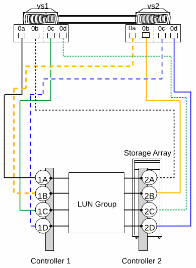

= Unterstützte Direct-Attached-Konfigurationen bei E-Series Storage-Arrays
:allow-uri-read: 
:icons: font
:imagesdir: ../media/

[role="lead"]
ONTAP Systeme können in Direct-Attached-Konfigurationen mit E-Series Storage Arrays verbunden werden. Sie müssen die Redundanz in den Verbindungen zwischen den ONTAP-Systemen und den Storage-Arrays überprüfen, um Ausfälle zu vermeiden. FlexArray Stretch MetroCluster unterstützt Direct-Attached-Konfigurationen mit E-Series Storage Arrays. Weitere Informationen finden Sie unter https://mysupport.netapp.com/matrix["NetApp Interoperabilitäts-Matrix-Tool"] und https://docs.netapp.com/us-en/ontap-metrocluster/install-stretch/index.html["Installation und Konfiguration von Stretch MetroCluster"].

Die Interoperabilitäts-Matrix enthält Informationen zu den spezifischen E-Series Array-Modellen, die in Direct-Attached-Konfigurationen mit dem ONTAP System unterstützt werden.

ONTAP unterstützt die folgenden Direct-Attached-Konfigurationen mit E-Series Storage Arrays:

== Eigenständige Grundkonfiguration

In einer eigenständigen Basiskonfiguration greifen zwei FC-Initiator-Ports vom ONTAP-System auf die Ports einer Array-LUN-Gruppe mit zwei Ports zu.

In der folgenden Abbildung ist eine Direct-Attached-Konfiguration dargestellt, bei der die ONTAP FC-Initiator-Ports 0a und 0h auf die Ziel-Ports einer Array-LUN-Gruppe mit zwei Ports zugreifen:

image::../media/da_2port_standalone.gif[Da 2-Port Standalone]

== Array-LUN-Gruppe mit vier Ports

Zwei FC-Initiator-Ports von jedem ONTAP-System in einem HA-Paar greifen auf verschiedene Storage-Array-Ports in einer Array-LUN-Gruppe mit vier Ports zu, um Redundanz in Verbindungen zu gewährleisten.

In der folgenden Abbildung ist eine Direct-Attached-Konfiguration dargestellt, bei der die ONTAP FC-Initiator-Ports auf die Zielports einer Array-LUN-Gruppe mit vier Ports zugreifen.

image::../media/da_4port_hapair.gif[Da 4-Port-Hapair]

Sie können auch vier FC-Initiator-Ports von jedem ONTAP-System im HA-Paar mit zwei verschiedenen Array-LUN-Gruppen mit vier Ports verbinden, sodass jeder FC-Initiator-Port in einem Port-Paar auf die alternative LUN-Gruppe zugreift.

Die folgende Abbildung zeigt eine Direct-Attached-Konfiguration, bei der die ONTAP FC-Initiator-Ports auf die Zielports von zwei Array-LUN-Gruppen mit vier Ports zugreifen:

image::../media/direct_attached_configuration_with_two_four_port_array_lun_groups.gif[Direkt verbundene Konfiguration mit zwei Array-lun-Gruppen mit vier Ports]

== Array-LUN-Gruppe mit acht Ports

Vier FC Initiator Ports von jedem ONTAP-System in einem HA-Paar greifen auf verschiedene Storage Array Ports in einer Array LUN-Gruppe mit acht Ports zu, um Redundanz in Verbindungen zu gewährleisten.

In der folgenden Abbildung ist eine Direct-Attached-Konfiguration dargestellt, bei der die ONTAP FC-Initiator-Ports auf die Zielports einer Array-LUN-Gruppe mit acht Ports zugreifen:

