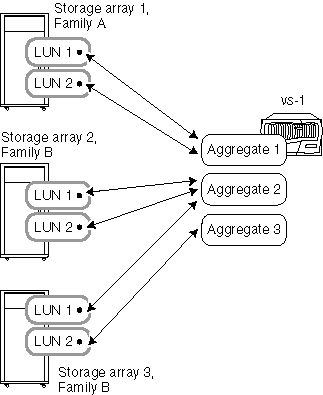

= Aggregieren Sie Regeln, wenn die Storage-Arrays von verschiedenen Anbietern oder Familien stammen
:allow-uri-read: 
:icons: font
:imagesdir: ../media/

[role="lead"]
Spezielle Regeln gelten für die Festlegung von Array-LUNs in Aggregaten, wenn die Storage-Arrays von verschiedenen Anbietern oder aus verschiedenen Storage-Array-Familien des gleichen Anbieters stammen.

Die folgenden Regeln gelten, wenn Ihre Storage-Arrays von verschiedenen Anbietern oder verschiedenen Familien desselben Anbieters stammen:

* Sie können keine Array-LUNs von Storage-Arrays verschiedener Anbieter oder von verschiedenen Familien desselben Anbieters im selben Aggregat kombinieren.
* Sie können das Aggregat, das das Stammvolume enthält, mit einem beliebigen Speicher-Array verknüpfen, unabhängig vom Familientyp des Speicher-Arrays.

[NOTE]
====
Stellen Sie beim Erstellen des Aggregats sicher, dass Sie explizit die IDs der Array-LUNs angeben, die Sie dem Aggregat hinzufügen möchten. Verwenden Sie die Parameter nicht, um die Anzahl und Größe der zu erfadenden Array-LUNs anzugeben, da das System möglicherweise LUNs aus einer anderen Familie oder aus einem Speicher-Array eines anderen Anbieters automatisch aufnehmen kann. Nachdem sich Array-LUNs verschiedener Familien oder Anbieter im gleichen Aggregat befinden, besteht die einzige Möglichkeit zur Behebung des Problems gemischter Array-LUNs in einem Aggregat darin, das Aggregat zu zerstören und es neu zu erstellen.

====
Die folgenden Beispiele zeigen Optionen für das Layout von Array-LUNs in Aggregaten, wenn die Storage-Arrays von unterschiedlichen Anbietern oder aus verschiedenen Familien desselben Anbieters stammen.

== Beispiel 1: Die LUNs der beiden Storage-Arrays befinden sich in unterschiedlichen Aggregaten

In diesem Beispiel stammen einige LUNs für ONTAP aus Speicher-Array 1 und Familie A, während die anderen LUNs für ONTAP aus Speicher-Array 2 stammen. Familie B. die LUNs aus den beiden Storage Arrays können nicht zum selben Aggregat hinzugefügt werden, da die beiden Storage Arrays aus verschiedenen Familien des gleichen Anbieters stammen. Dies wäre mit einem Unterschied, wenn die beiden Storage Arrays von verschiedenen Anbietern stammten.

image::../media/luns_assigned_to_multiple_aggrs_dif_family.gif[Diese Grafik wird durch den umgebenden Text beschrieben.]

== Beispiel 2: Einige LUNs können im gleichen Aggregat gemischt werden, andere dagegen nicht

In diesem Beispiel ein Storage Array stammt aus Familie A und die anderen beiden Storage Arrays stammen aus Familie B. die LUNs aus Familie A Storage Array können nicht zu demselben Aggregat hinzugefügt werden wie die LUNs aus einem Familie B Storage Array, da die Storage Arrays aus verschiedenen Familien stammen. LUN 1 von Storage Array 3 kann jedoch dem Aggregat 2 zugewiesen werden, das auch LUNs aus Storage Array 2 enthält, da sich die beiden Speicher-Arrays in derselben Familie befinden.

