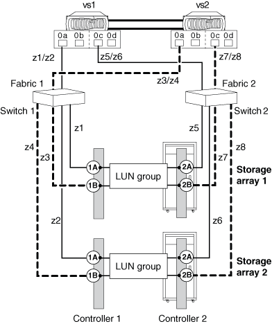

= Beispielkonfiguration: Gemeinsame FC-Initiator-Ports
:allow-uri-read: 
:icons: font
:imagesdir: ../media/

[role="lead"]
Ein FC-Initiator-Port auf einem ONTAP System kann mit bis zu vier Ziel-Ports auf separaten Storage Arrays oder bei manchen Storage Arrays mit vier Ziel-Ports auf denselben Storage Arrays verbunden werden.

Als Best Practice empfiehlt sich das Zoning, jedes FC-Initiator-Ziel-Port-Paar in einer separaten Zone (1:1) zu haben, auch wenn derselbe FC-Initiator mit mehreren Ziel-Ports kommuniziert.

== Gemeinsamer FC-Initiator-Port verbunden mit mehreren Ziel-Ports auf _separaten_ Speicher-Arrays

Die folgende Abbildung zeigt Verbindungen und Zoning für die gemeinsame Nutzung eines FC-Initiator-Ports mit Zielports auf _different_ Speicher-Arrays.

Die durchgehenden Linien in der folgenden Abbildung zeigen die Verbindungen von den FC-Initiator-Ports auf System vs1 und die gestrichelten Linien zeigen die Verbindungen von den FC-Initiator-Ports auf System vs2.

In der folgenden Tabelle sind die 1:1 Zoning-Definitionen für das Beispiel eines FC-Initiator-Ports aufgeführt, der mehrere Ziel-Ports auf verschiedenen Speicher-Arrays gemeinsam verwendet.

|===
| Zone | Port des ONTAP Systems und FC Initiator | Storage Array erledigen 

 a| 
*Schalter 1*

 a| 
z1
 a| 
vs1:0a
 a| 
Speicher-Array 1: Controller 1 Port 1A

 a| 
z2
 a| 
vs1:0a
 a| 
Speicher-Array 2: Controller 1 Port 1A

 a| 
z3
 a| 
vs2:0a
 a| 
Speicher-Array 1: Controller 1, Port 1B

 a| 
z4
 a| 
vs2:0a
 a| 
Speicher-Array 2: Controller 1 Port 1B

 a| 
*Schalter 2*

 a| 
z5
 a| 
vs1:0c
 a| 
Speicher-Array 1: Controller 2 Port 2A

 a| 
z6
 a| 
vs1:0c
 a| 
Speicher-Array 2: Controller 2 Port 2A

 a| 
z7
 a| 
vs2:0c
 a| 
Speicher-Array 1: Controller 2 Port 2B

 a| 
z8
 a| 
vs2:0c
 a| 
Speicher-Array 2: Controller 2 Port 2B

|===

== Gemeinsamer FC-Initiator-Port verbunden mit mehreren Ziel-Ports auf dem _same_ Speicher-Array

Diese Konfiguration kann nur mit Speicher-Arrays verwendet werden, deren LUN-Masking-, Präsentations- oder Hostgruppenfähigkeit unterschiedliche LUN-Gruppenpräsentationen für denselben FC-Initiator ermöglicht, basierend auf dem Zielport, auf den zugegriffen wird.

Einige Speicher-Arrays können einem FC-Initiator je nach Zielport, auf den zugegriffen wird, unterschiedliche Sätze logischer Geräte zur Verfügung stellen. Bei diesen Speicherarrays kann sich derselbe FC-Initiator in mehreren Hostgruppen befinden. Bei Speicher-Arrays mit dieser Funktion kann jeder FC-Initiator auf mehrere Array-Ziel-Ports auf demselben Speicher-Array zugreifen, wobei jeder Ziel-Port dem FC-Initiator eine andere LUN-Gruppe präsentiert. Prüfen Sie in der Dokumentation Ihres Speicher-Arrays, ob Ihr Speicher-Array es zulässt, dass sich derselbe FC-Initiator in mehreren Host-Gruppen befindet.

Die folgende Abbildung zeigt Verbindungen und Zoning für die gemeinsame Nutzung eines FC-Initiator-Ports mit mehreren Zielports auf dem _same_ Speicher-Array. In diesem Beispiel werden Zoning-Definitionen als 1:1 konfiguriert, d. h. ein FC-Initiator und ein Ziel-Port.

Die durchgehenden Linien in der folgenden Abbildung zeigen die Verbindungen von den FC-Initiator-Ports auf System vs1 und die gestrichelten Linien zeigen die Verbindungen von den FC-Initiator-Ports auf System vs2. Für diese Konfiguration sind zwei LUN-Gruppen erforderlich.

image::../media/shared_initiator_ports_same_array.gif[Die Anschlüsse und die Zonierung sind im umgebenden Text beschrieben.]

In der folgenden Tabelle sind die 1:1 Zoning-Definitionen für das Beispiel eines FC-Initiator-Ports aufgeführt, der mehrere Ziel-Ports auf demselben Storage-Array gemeinsam verwendet.

|===
| Zone | Port des ONTAP Systems und FC Initiator | Speicher-Array und Port 

 a| 
Schalter 1

 a| 
z1
 a| 
vs1:0a
 a| 
Controller 1 Port 1A

 a| 
z2
 a| 
vs1:0a
 a| 
Controller 1 Port 1C

 a| 
z3
 a| 
vs2:0a
 a| 
Controller 1 Port 1B

 a| 
z4
 a| 
vs2:0a
 a| 
Controller 1 Port 1D

 a| 
Schalter 2

 a| 
z5
 a| 
vs1:0c
 a| 
Controller 2 Port 2A

 a| 
z6
 a| 
vs1:0c
 a| 
Controller 2 Port 2C

 a| 
z7
 a| 
vs2:0c
 a| 
Controller 2 Port 2B

 a| 
z8
 a| 
vs2:0c
 a| 
Controller 2 Port 2D

|===