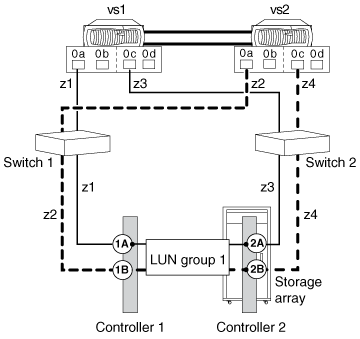

= Gültiges Pathing: Eine Array-LUN-Gruppe mit 4 Ports in einer Fabric-Attached-Konfiguration
:allow-uri-read: 
:icons: font
:imagesdir: ../media/

[role="lead"]
Eine einzelne Array-LUN-Gruppenkonfiguration mit 4 Ports arbeitet mit allen Storage Arrays für alle ONTAP Versionen zusammen.

Die folgende Abbildung zeigt das Pathing in einer Konfiguration mit einer einzelnen Array-LUN-Gruppe mit 4 Ports:

In dieser Konfiguration mit einer einzelnen LUN-Gruppe mit 4 Ports sind Array-LUNs vier Ports auf dem Speicher-Array zugeordnet. Die Array-LUN-Gruppe wird beiden Nodes im HA-Paar auf verschiedenen Array-Ziel-Ports präsentiert. Jeder Node kann jedoch eine Array-LUN über nur zwei Pfade End-to-End sehen. Zoning ist so konfiguriert, dass jeder FC-Initiator-Port auf einem Node nur auf einen einzelnen Ziel-Array-Port zugreifen kann.

Es ist hilfreich, Ihre Ausgabe mit einer gültigen Ausgabe zu vergleichen `storage array config show` , wenn Sie überprüfen, ob die Anzahl der LUN-Gruppen, die Sie erwartet haben, eingerichtet wurde. Das folgende `storage array config show` Ausgabebeispiel zeigt die erwartete Ausgabe für diese Konfiguration - eine einzelne Array-LUN-Gruppe:

[listing]
----
vs::> storage array config show
             LUN   LUN
Node         Group Count  Array Name     Array Target Port     Initiator
------------ ----- ----- ------------- ----------------------- ---------
vs1            1    10   DGC_RAID5_1      50050763030301241A     0a
                                          50050763031301242A     0c
vs2            1    10   DGC_RAID5_1      50050763030881241B     0a
                                          50050763031881242B     0c

4 entries were displayed.
----